# Goofy Heads

This game is written in C+Raylib. I have written custom physics system for this.
You can play with various characters who have unique and fun abilities.
This game also supports controllers.

itch.io link is [here](https://cflexer.itch.io/goofy-heads).

## In-game photos

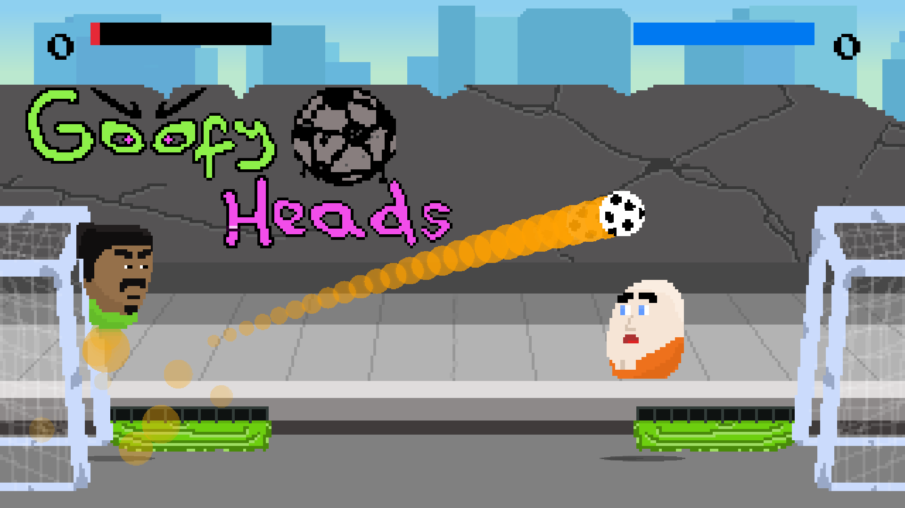
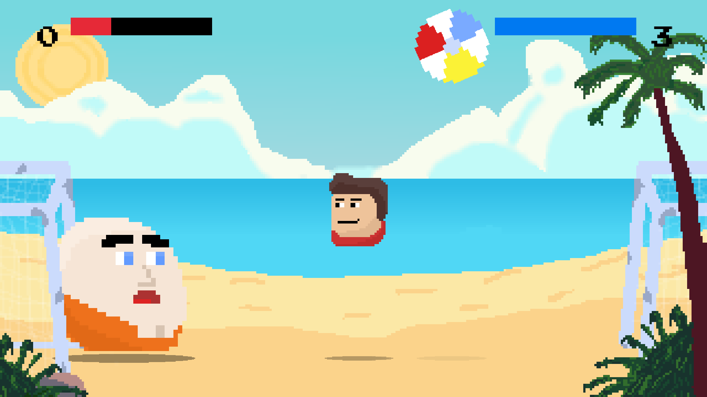
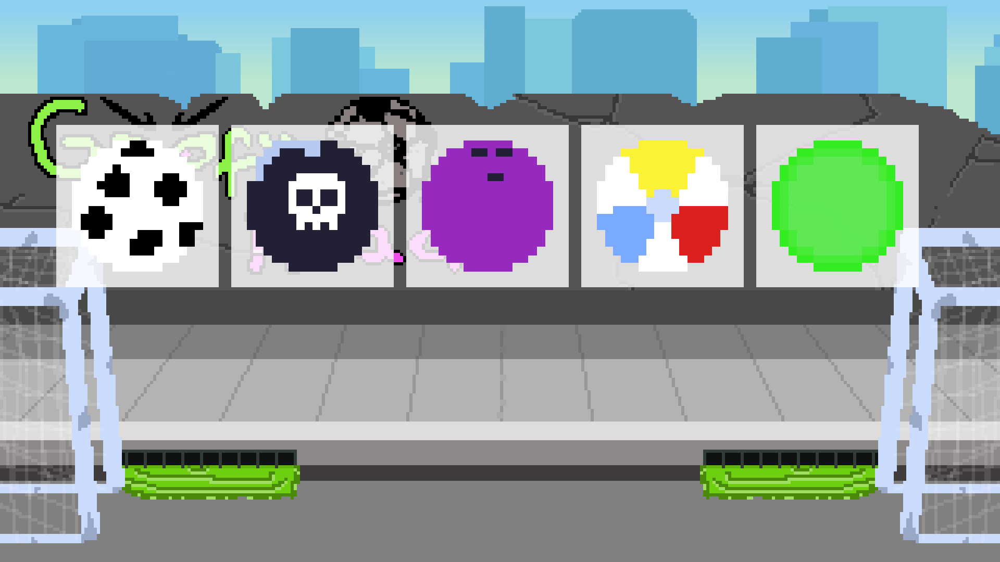
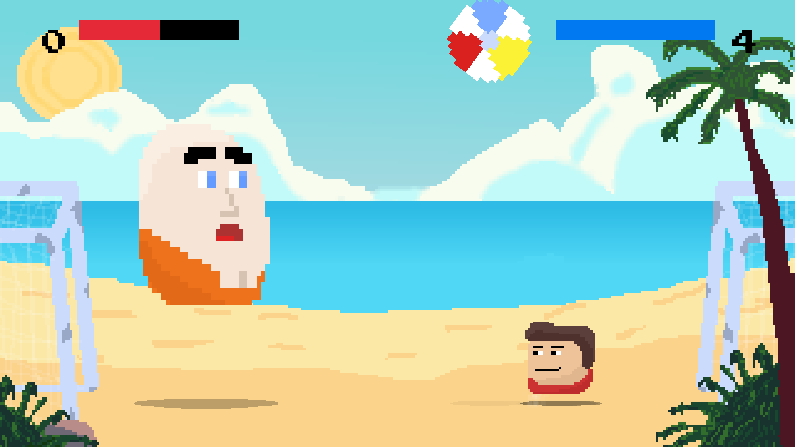
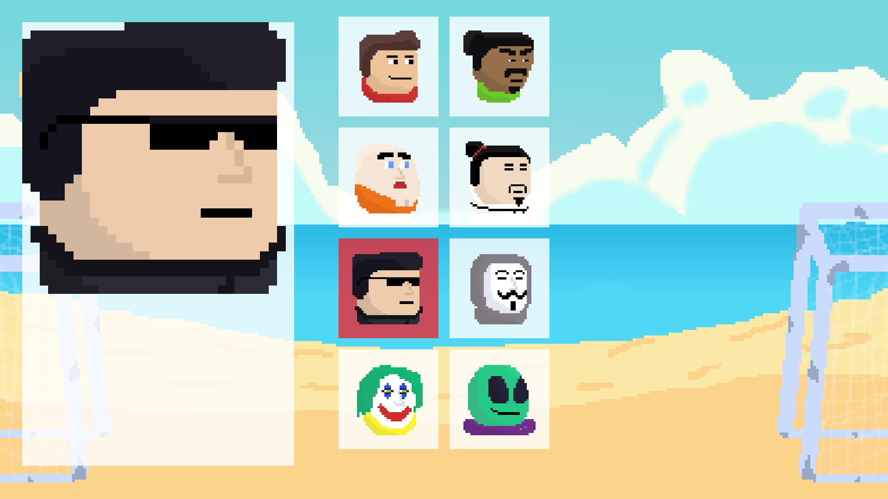
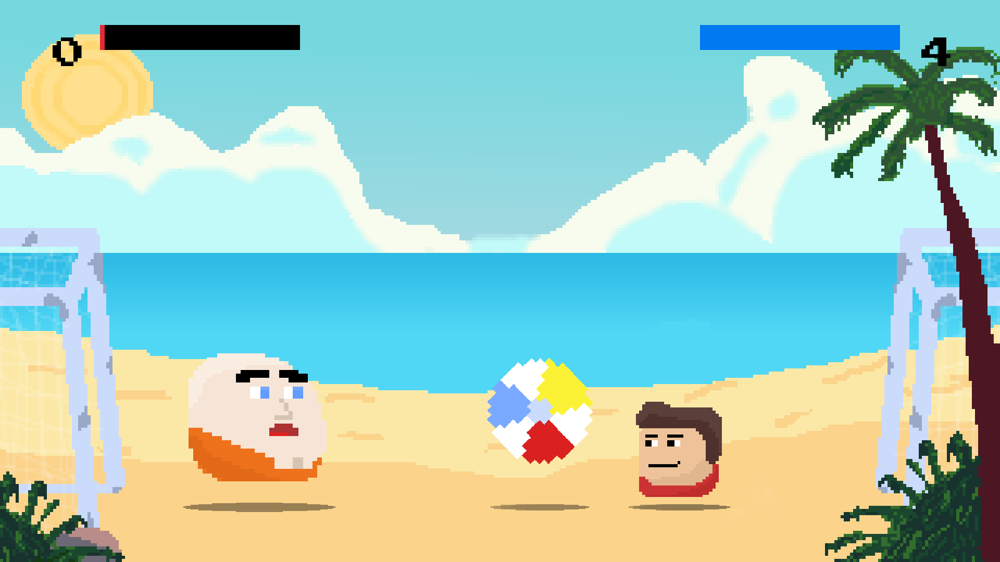
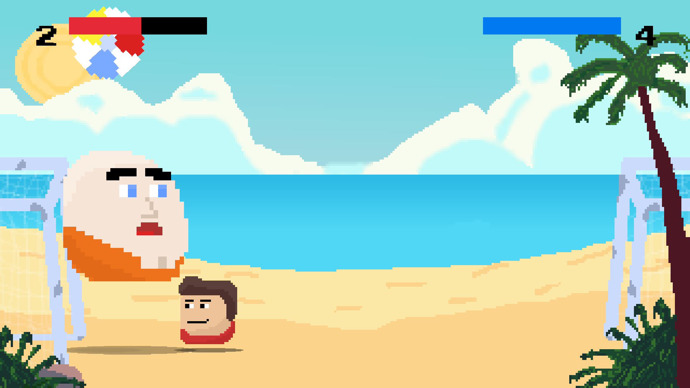
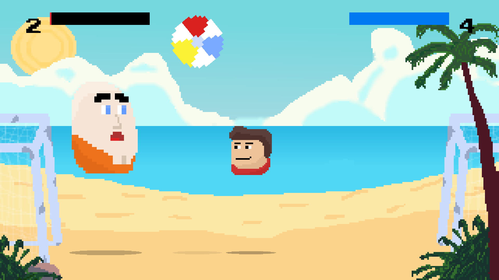
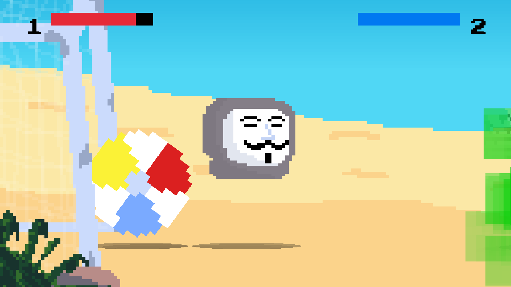
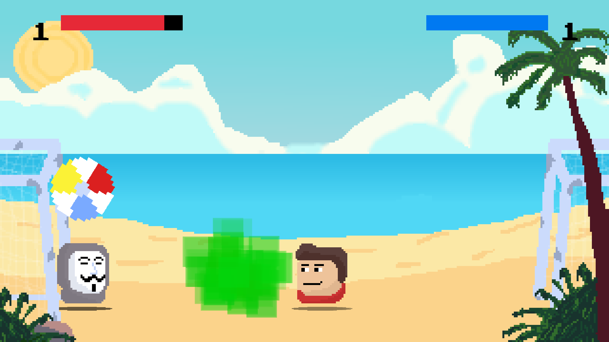

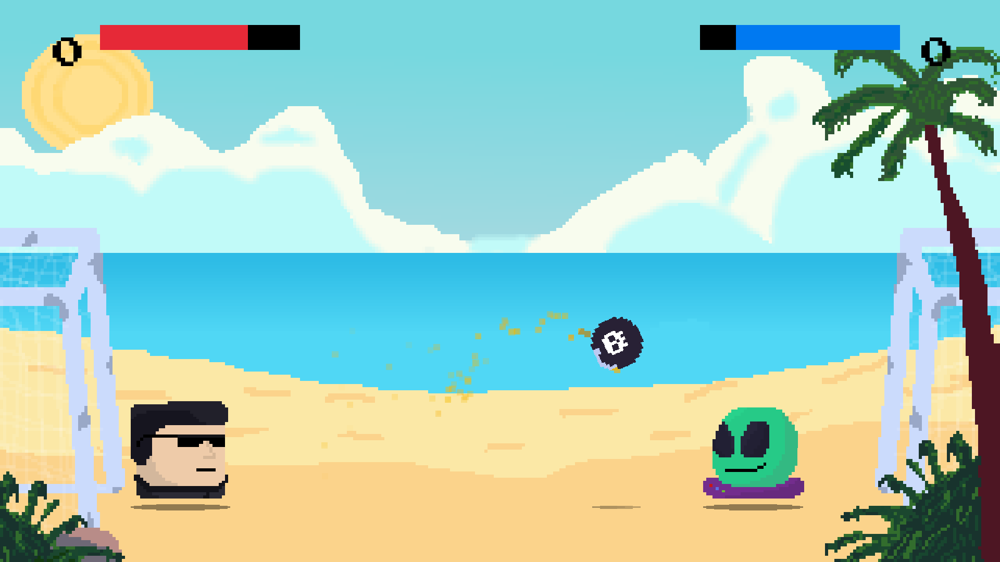
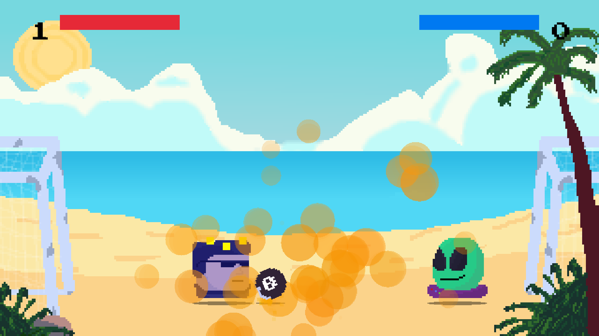
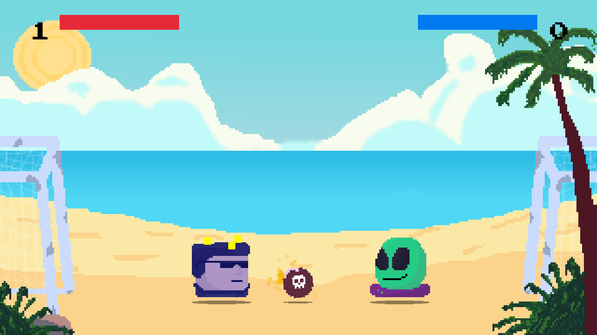
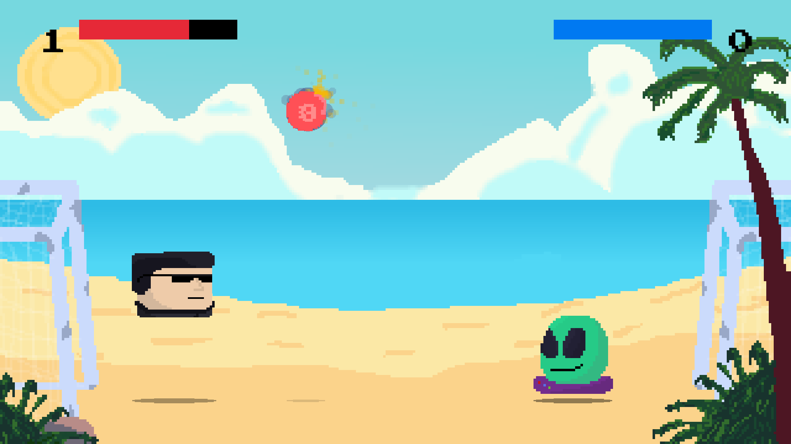
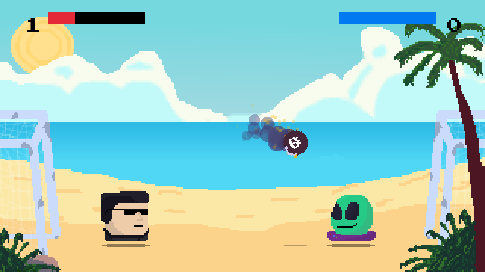
